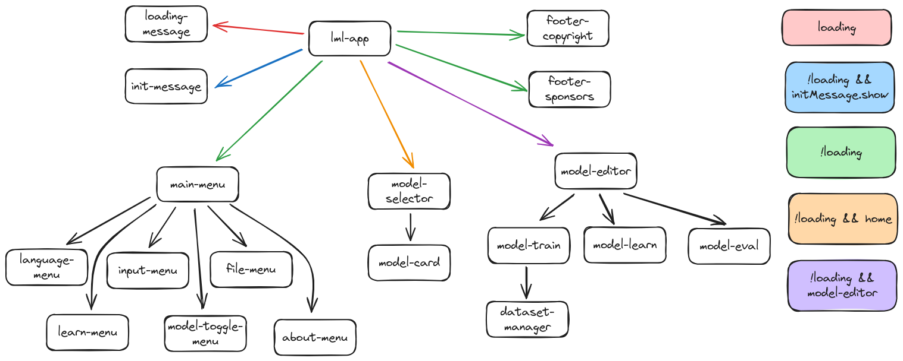

## Entorno de desarrollo

Requisitos: node 20.11.0

1. clonar el proyecto: 
```
git@gitlab.com:lml-corp/lml-editor-lit.git
cd lml-editor-lit
```
2. Ejecutar el servidor de desarrollo
```
npm run dev
```
3. Apuntar el navegador web a `http://localhost:5173`

## Construcción de un desplegable

Ejecutar la instrucción:
```
npm run build
```

En la carpeta `dist` se generará el código HTML/CSS/JS estático listo para ser desplegado en un servidor web.

>Nota: Este desplegable se ha construido pensando en que la aplicación se va a servir en la ruta `/editor/`. Si se quiere cambiar este comportamiento hay que modificar el script `build` del archivo `package.json`:
>```
>"build": "vite build --base /editor/"
>```

## Fichero `.env`

La aplicación se configura a través de variables de entorno que se declara en el fichero `.env` 


|variable| Valor por defecto| Descripción|
|--|--|--|
|`URL_BASE`| /editor|Esta variable se usa tanto en el entorno de desarrollo como en el desplegable que se construye con `npm run build`.|
|`INIT_MESSAGE_SHOW`|true| Para mostrar un mensaje de inicio|
|`INIT_MESSAGE_TITLE`|Atención|Título del mensaje de inicio|
|`INIT_MESSAGE_DESCRIPTION`|LearningML necesita tu ayuda|Descripción del mensahe de incio|
|`URL_SCRATCH`|http://localhost:8888/scratch|URL de la instancia de Scratch|

## Traducciones

En el archivo `lit-localize.json` se configura el sistema de traducción. Lo importante es el atributo `targetLocales`, donde se especifica en un array los idiomas a los que se traducirá la aplicación.

Para construir los archivos xliff se ejecuta el comando:
```

./node_modules/.bin/lit-localize extract

```
Que genera la carpeta `xliff` con los archivos de traducción. Se editan estos ficheros con las traducciones correspondientes.

A continuación se generan los archivos javascript que usa la aplicación para traducir lanzando el comando:
```

./node_modules/.bin/lit-localize build

```
Referencia: https://lit.dev/docs/localization/overview/
## Estructura de componentes


